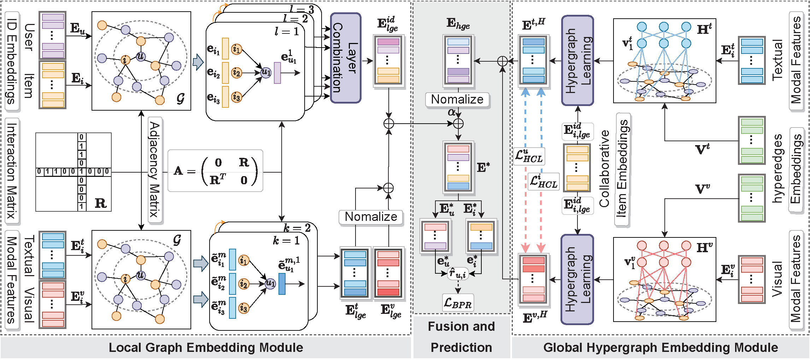

## LGMRec (AAAI'24)

This is the Pytorch implementation for our AAAI 2024 paper:
>Zhiqiang Guo, Jianjun Li, Guohui Li, Chaoyang Wang, Si Shi, Bin Ruan. LGMRec: Local and Global Graph Learning for Multimodal Recommendation. In AAAI 2024. [Paper](https://ojs.aaai.org/index.php/AAAI/article/view/28688)

### Overview

### Environment

pip install -r requirements.txt

### Data

Download from Google Drive: [Baby/Sports/Clothing](https://drive.google.com/drive/folders/1BxObpWApHbGx9jCQGc8z52cV3t9_NE0f?usp=sharing).
The data contains text and image features extracted from Sentence-Transformers and VGG-16 and has been publiced in [MMRec](https://github.com/enoche/MMRec) framework.

### Run

1. Put your downloaded data (e.g. baby) under `data/` dir.
2. Run `train.sh` to train LGMRec:
  `bash train.sh`
You may specify other parameters in CMD or config with `configs/model/*.yaml` and `configs/dataset/*.yaml`.

### Citation

    @inproceedings{guo2024lgmrec,
    author = {Zhiqiang Guo, Jianjun Li, Guohui Li, Chaoyang Wang, Si Shi, Bin Ruan},
    title = {LGMRec: Local and Global Graph Learning for Multimodal Recommendation},
    booktitle = {Proceedings of AAAI 2024},
    pages = {8454-8462},
    year = {2024}
    }
